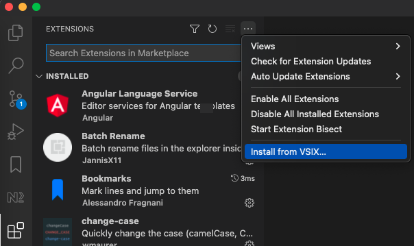

# Vscode Extensions

## Installation

1. Download the vsix file of the extension you want to install.
2. Open the Extensions view by clicking on the Extensions icon in the Activity Bar.
3. Open the menu by clicking on the top right button.

   

4. Click on `Install from VSIX...` and pick the downloaded vsix file.

## Extension overview

- Create branches with names conform to LeanIX naming conventions with Git Utils ([VSIX file](https://github.com/sabine-prokop/vscode-extensions/blob/main/gitutils/gitutils-0.0.1.vsix), [documentation](https://github.com/sabine-prokop/vscode-extensions/blob/main/gitutils/README.md)).
