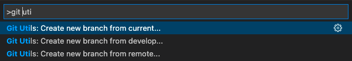
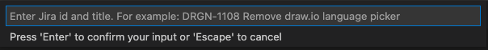
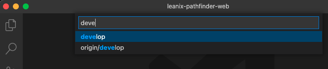

# Git Utils

Create branches with names conform to LeanIX naming conventions.

## Features

Git Utils provides three commands

- `Git Utils: Create new branch from develop...` creates new branch from develop.
- `Git Utils: Create new branch from current...` creates new branch from the current branch.
- `Git Utils: Create new branch from remote...` creates new branch from a remote branch.

Each command opens an input where the desired branch name can be entered.

For example the Jira ticket ID including the title can be copied into this input. The `feature` prefix and the formatting of the branch name are automatically applied after pressing enter.

Entering `DRGN-222 Bug/Issue fix` results in a branch named `feature/drgn-222-bug-issue-fix`.

#### Git Utils: Create new branch from current...

`Git Utils: Create new branch from current...` opens an input which is prefilled with the name of the current branch.

Pressing enter creates a branch containing all changes of the current branch.

#### Git Utils: Create new branch from remote...

`Git Utils: Create new branch from remote...` opens a searchable selection containing all local and remote branches.

After selecting a branch an input is opened which is prefilled with the name the remote branch.

Pressing enter creates a branch containing all changes of the previously selected branch.

## Requirements

Git must be installed and configured.
